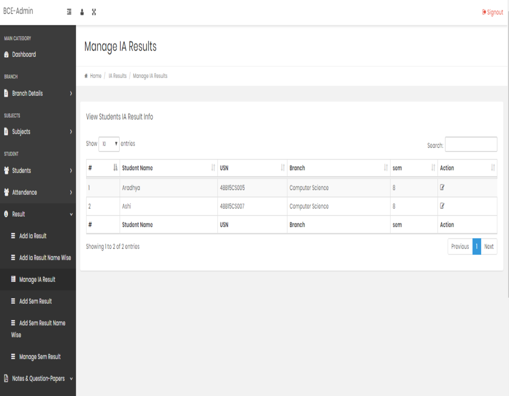

#  Engineering College Academic Management System
CAMS is web application is  to maintain and  manage  college academics details.

A PHP-based system to streamline academic management for students and administrators.

Overview
This application provides a central platform for managing academic information in an engineering college, with dedicated portals for students and administrators.

Features:

Student Portal:

Sign up and access: Easy registration using university seat number.
View academic info: Access IA marks, semester marks, attendance details, and assignments.
Download results: Generate and download PDFs of semester results.
Stay informed: View important notifications and announcements.
Admin/Staff Portal:

Manage attendance: Record and update student attendance for each subject.
Input results: Enter IA and semester marks subject-wise for individual students.
Upload assignments: Assign and manage student assignments with deadline tracking.
Publish notifications: Share crucial information and updates with students.
Benefits:

Increased efficiency: Streamlines academic data management and saves time.
Enhanced transparency: Provides students with easy access to academic information.
Improved communication: Facilitates efficient communication between students and administrators.
Simplified workload: Automates routine tasks and reduces manual work for staff.
Technologies:

Backend: PHP
Database: (specify the database you're using, e.g., MySQL)
Optional: Additional technologies like frameworks or libraries (mention if applicable)
Getting Started:

Clone the repository.
Configure the database connection in config.php.
Populate the database with data using the provided scripts.
Access the application through the student and admin portal interfaces.
Contributing:

We welcome contributions! Please read the CONTRIBUTING.md file for guidelines on submitting pull requests.

Feedback:

We appreciate your feedback! Feel free to report issues or suggest improvements on the GitHub repository.

License:

This project is licensed under the [specify the license you're using, e.g., MIT License].

Disclaimer:

This is a sample README file, and you should customize it to match your specific project details and features.

<h2>Student Portal<h2> 
 

 <h3>Login Page</h3>

 <h3>Student dashboard</h3>

 <h3>IA Result</h3>

 <h3>Digital Notes can be downloaded </h3>

 <h3>Important Website links</h3>

 <h3>Admin dashboard</h3>

 <h3>Admin Features</h3>

 <h3>Add IA Results</h3>

<h3>Upload Notes</h3>

<h3>Manage IA Results</h3>

<h3>Edit IA Results</h3>

